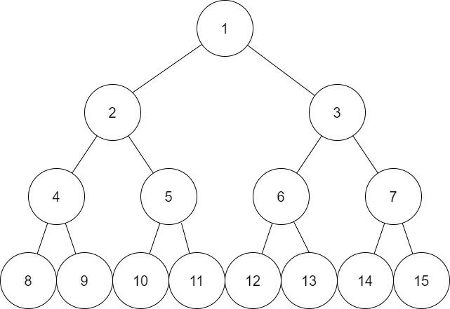

# In-order traversal

[get back to binary tree file](binTree.md)
[get back to tree traversal file](traversal.md)

## Algorithm
- traverse the left subtree
- visit the root
- traverse the right subtree

## Typical for binary search tree
We can retrieve all the data in sorted order using in-order traversal

## Example:
