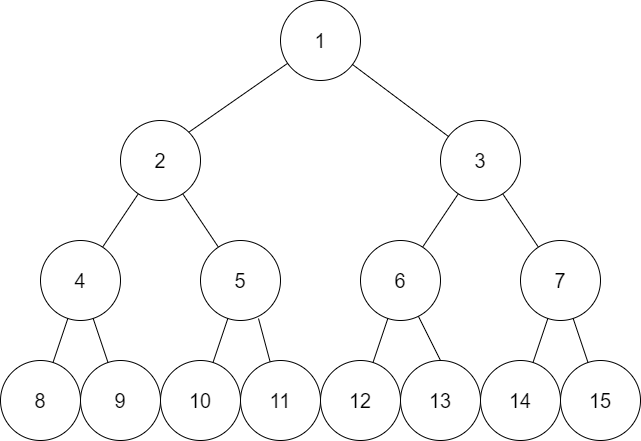

# Pre-order traversal

[get back to binary tree file](binTree.md)
[get back to tree traversal file](traversal.md)

## Algorithm
- visit root first
- traverse the left subtree
- traverse the right subtree

## Example:
